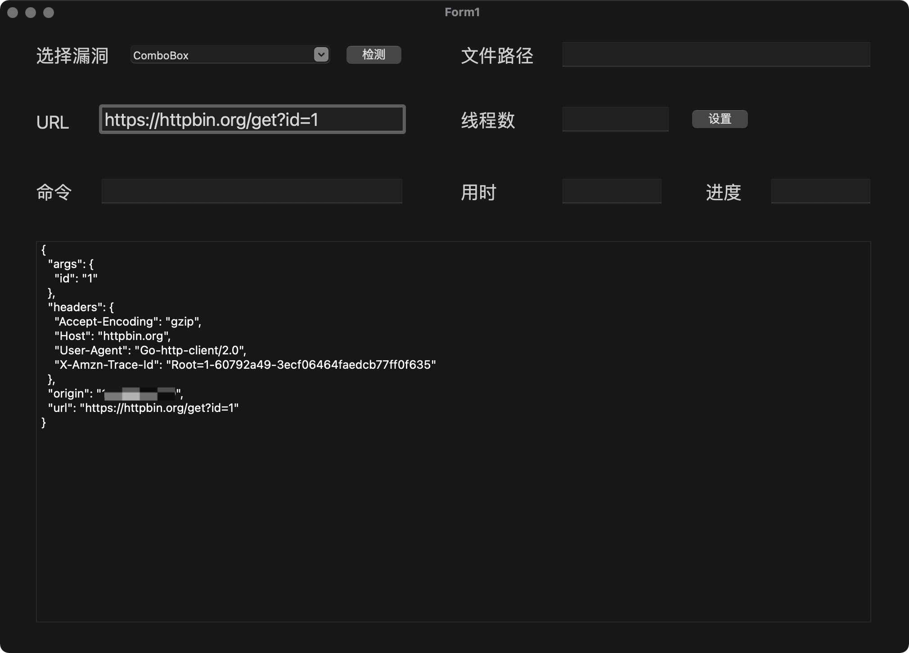

## CE. Carry EXP

技术栈：

| 功能      | 解释                                                   | 实现  | 参考地址                                                     |
| --------- | ------------------------------------------------------ | ----- | ------------------------------------------------------------ |
| GUI       | 漏洞、目标、文件、命令、线程数、用时、进度、结果展示等 | govcl | [https://github.com/ying32/govcl](https://github.com/ying32/govcl) |
| 网络请求  | GET、POST等HTTP请求                                    | 原生  |                                                              |
| 多线程    | 或协程并发                                             | 原生  |                                                              |
| 自定义POC | 自定义漏洞利用配置文件                                 | yaml  | https://github.com/go-yaml/yaml                              |
| ...       | ...                                                    | ...   | ...                                                          |

GUI需要通过lazarus IDE拖拽组件并设置事件监听，然后配合res2go插件生成govcl代码。

Demo：

